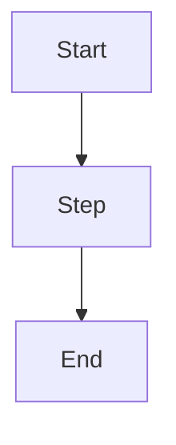

# Diagram: [Name]

**Type:** flow | system | ost | sequence | journey

## Context

*What does this diagram show? Why does it exist?*

## Diagram

## Connections

- [[opportunities/opportunity-name]]
- [[solutions/solution-name]]

## Change log

| Date | Change | Why |
|---|---|---|
| | | |
